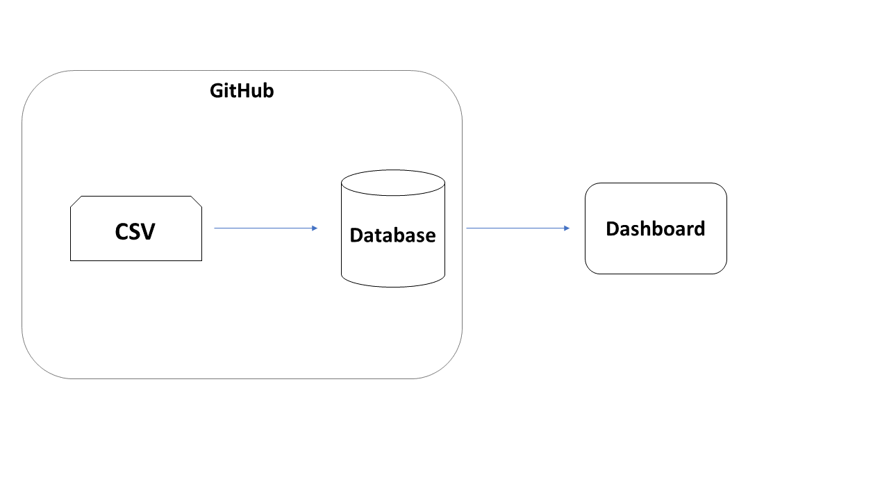
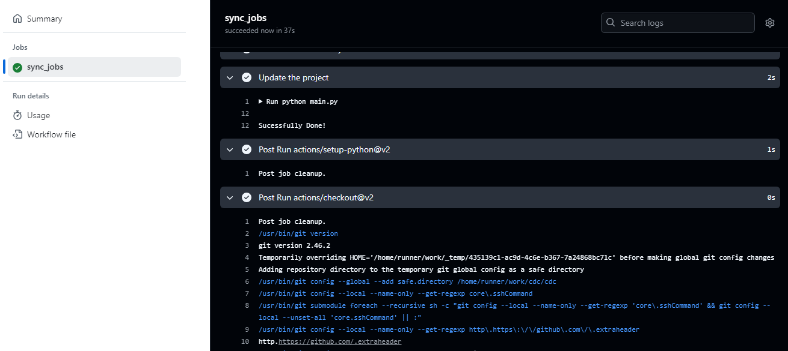

# cdc

The cdc is a tool designed to ensure the data is pulling to database, each push in main on Github the Github Actions do a insgestion to a database and then create the dashboards.





## Automated Testing

Automated tests have been incorporated into the `ci.yml` file and are triggered on each push on main. This ensures that future developments in the code will not affect the validation rules previously agreed upon with the business area.

---

With the cdc, you can be sure that your data is always compliant with business rules, ensuring the integrity of the business area indicators.


### Installation and Configuration

1. Clone the repository:
```bash
git clone https://github.com/aguiarpaulo/cdc.git
cd cdc
```
2. Configure the correct Python version with `pyenv`:
```bash
pyenv install 3.11.3
pyenv local 3.11.3
```
3. Install project dependencies:
```bash
poetry init
poetry shell
pip install -r requirements.txt # using pip
```
4. Run and test the project:
```bash
poetry run python src/main.py
```